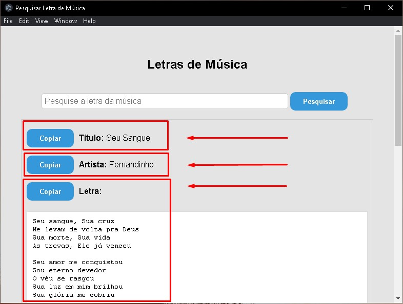

# Get Letras API

## Tópicos do README
- *Demonstração com imagens*
- *Link para download*
- *Tecnologias Utilizadas*
- *Visão Geral*
- *Como utilizar Localmente*
- *Passo a Passo da API*

### Tela inicial (1/3)


### Pesquisando letra (2/3)


### Resposta da requisição (3/3)


### Download .exe:
  ```bash
  https://drive.google.com/drive/folders/1FIqnJ9wpoHELOp9llJOW9wfgoXIj1po0?usp=sharing
  ```

## Tecnologias Utilizadas
- **Node.js**
- **TypeScript**
- **JavaScript**
- **Express.js**
- **Cluster (para balanceamento de carga)**
- **Express.js**
- **Concurrently (para executar Front-End e Back-End juntos)**
- **HTML Parsing**
- **HTTP Requests**

## Visão Geral
Este aplicativo foi desenvolvido para solucionar um problema de uma igreja.
Vi que tínhamos um problema na mídia da igreja que faço parte e criei a solução.
Sempre que alguém cantava uma música que não tinha cadastrado no programa do projetor do telão (Holyrics), tínhamos que fazer tudo isso de forma manual.
O programa busca letras de músicas gospel diretamente do site [letras.mus.br](https://www.letras.mus.br/) utilizando uma pesquisa automatizada nos motores de busca.

## Como Utilizar Localmente
- **Descrição**: Instale as dependências "`npm run setup`" e utilize "`npm run start`" para iniciar o Front-End e o Back-End *(localhost:9999)* ao mesmo tempo com a lib de desenvolvimento "`concurrently`".

```bash
git clone https://github.com/Everton-Lourens/Get-Letras-API.git
cd Get-Letras-API
npm run setup
npm run start
```

- **Exemplo de requisição**:
```bash
http://localhost:9999/v1/music/search?text=fernandinho+seu+sangue&title=true&lyrics=true
```

- **Exemplo de requisição com ID**:
```bash
http://localhost:9999/v1/music/get?id=f85e9cc4-d4eb-41a4-955e-7587d8aa7a31
```
## Passo a Passo da API

**0.** *Balanceador de carga com Cluster:*
A API opera com um balanceador de carga em cluster de 3 workers/processos ativos, evitando sobrecarga no servidor caso tenha uma alta demanda de requisições, podendo aumentar ou diminuir os workers conforme demanda.

*Funcionamento do Cluster:*
- O processo principal (master) cria múltiplos workers (processos filhos).
- Cada worker escuta as mesmas conexões, funcionando como cópias independentes do servidor.
- O sistema operacional distribui as requisições entre os workers de forma balanceada.
- Nesta API, o cluster possui 3 workers/processos em execução.
- Se um worker falhar, o processo principal detecta o erro e cria um novo automaticamente.

**1.** O usuário fornece o nome da música gospel que deseja buscar através da rota `http://localhost:9999/search`, utilizando parâmetros de consulta (query params), como:

   - `text` (obrigatório): nome da música ou trecho.
   - `title`, `artist`, `author`, `lyrics` (opcionais): filtros booleanos para refinar a busca.

   **Exemplo de requisição:**

```bash
/search?text=uma+coisa+peço+ao+Senhor&title=true&artist=true&lyrics=true
```

**2.** A API verifica se a letra já está salva no banco de dados local (SQLite):

```ts
const searchMusicDatabase = await findMusic(query);
```

**3.** Se a música for encontrada no banco, a API responde com status 200 e retorna os dados.

**4.** Caso a letra não esteja no banco, a API executa uma busca automática em múltiplos motores de busca com a seguinte query:

```bash
nome-da-musica + " gospel site:letras.mus.br"
```

**5.** O primeiro link do domínio letras.mus.br encontrado nos buscadores é acessado.

**6.** A página da música é processada via HTML parsing (utilizando a biblioteca Cheerio), e a letra é extraída com a remoção de elementos HTML desnecessários.

**7.** A letra extraída é:
  - Retornada ao usuário com status 201
  - Salva no banco de dados para consultas futuras:

```ts
// Se a letra não for encontrada no banco de dados local, pesquisa nos motores de busca
getLyric(text).then((response) => {
    // Salvando a letra no banco de dados local
    const newMusic = new mySqliteMusic();
    newMusic.save(response);
    // retornando a letra
    res.status(201).json([response]).end();
}).catch(() => {
    res.status(422).end();
});
```

**8.** Se nenhum resultado válido for encontrado, a API responde com status 422.